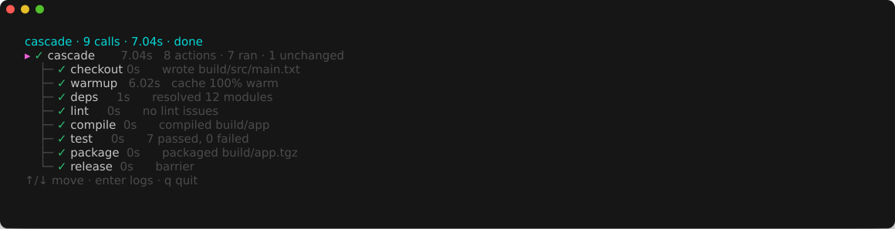
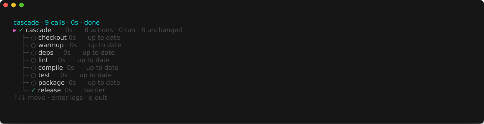
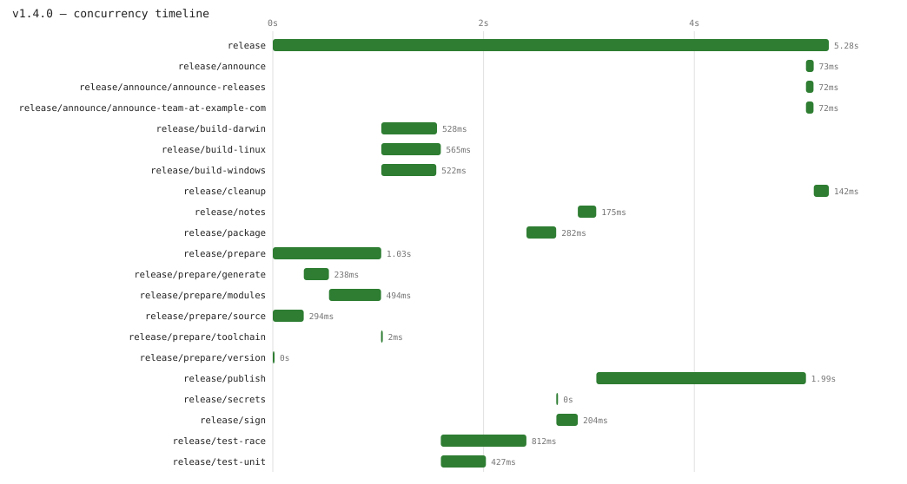

# cascade

**cascade** is a workflow runner with two interfaces:
1. **A command-line tool** that runs pipelines of shell commands declared in YAML.
2. **A Go library** for building workflows directly in code when static YAML isn't expressive enough.

Both provide a live terminal tree while running, an append-only journal that supports resuming interrupted runs, and automatic caching to skip tasks whose inputs have not changed.

## Declare a pipeline

```yaml
name: build

actions:
  deps:
    run: go mod download
    produces: [go.sum]
    sources: [go.mod]

  compile:                       # runs once deps is up to date
    run: go build -o build/app ./cmd/app
    needs: [deps]
    produces: [build/app]        # skip if newer than every source file
    sources: ["**/*.go"]

  test:
    run: go test ./...
    needs: [deps]                 # runs alongside compile, not after it

  package:
    run: docker build -t app:latest .
    needs: [compile, test]       # waits for both

  snapshot:
    run: restic backup ~
    every: 24h                   # skip if last succeeded < 24h ago
```

```bash
go install github.com/m-d-brown/cascade/cmd/cascade@latest
cascade run -f build.yaml   # runs all actions
cascade run -f build.yaml   # runs again: everything is already up to date
cascade status -w           # watch progress of a running pipeline from another terminal
```

## What that looks like

[`examples/cascade`](examples/cascade) is a self-contained build pipeline using only core utilities:



Running it again with unchanged files checks freshness and skips unnecessary work:



`cascade check` validates a pipeline file before execution, catching cyclic dependencies, missing targets, or schema errors with exact line numbers. `cascade dot` and `cascade graph` generate Graphviz diagrams of execution traces and declared dependency graphs.

See the **[pipeline specification](docs/pipeline-spec.md)** for the complete YAML schema and caching rules.

## The Go Engine

Static YAML works well for fixed pipelines. When a workflow requires dynamic branching, loops, or runtime fan-out, Cascade provides a Go library where workflows are written directly in code. There is no separate DAG structure to build or maintain; execution order and concurrency follow standard Go control flow.

```go
signed, err := work.Do(ctx, "sign", func(ctx *work.Context) (string, error) {
    return sign(ctx, archive, signKey)
})

linux := work.Go(ctx, "build-linux", func(ctx *work.Context) (string, error) { return build(ctx, "linux") })
darwin := work.Go(ctx, "build-darwin", func(ctx *work.Context) (string, error) { return build(ctx, "darwin") })
a, err := linux.Get()
b, err := darwin.Get()
```

`work.Do` runs a task synchronously and waits for its result. `work.Go` launches a task concurrently in a separate goroutine and returns a `Future`.

Each call is assigned a hierarchical path based on its name and parent call (for example, `release/build-linux`). This path serves as the consistent identifier across all tools: the live terminal tree, individual and combined text logs (`flow.log`), structured events (`run.jsonl`), Graphviz DOT traces, and Chrome trace flamegraphs.

| Feature                      | Description                                                                                                                          |
|:-----------------------------|:-------------------------------------------------------------------------------------------------------------------------------------|
| **No declared graph**        | Workflows are standard Go functions. Sharing work means calling a function once and passing its return value down.                   |
| **Type-safe outputs**        | `work.Do[T]` and `Future[T]` return strongly typed values. Type mismatches are caught at compile time.                               |
| **Visible concurrency**      | Tasks run concurrently via `work.Go` and are synchronized with `Future.Get`, with total concurrency bounded by `--jobs`.             |
| **Fine-grained caching**     | `work.LastRecord` inspects previous successful runs to skip expensive operations before they start.                                  |
| **Dry-run and confirmation** | The optional [`world`](world) package lets workflows intercept side effects for `--dry-run` inspection or interactive user approval. |
| **Resumption**               | `--continue` restores results from previously succeeded calls in an interrupted run, executing only what remains.                    |
| **Execution traces**         | `dot` and `flamegraph` generate visual representations of a specific run's execution hierarchy and concurrency timeline.             |

Visualizing concurrency using the flamegraph from [`examples/engine/complete`](examples/engine/complete) in [ui.perfetto.dev](https://ui.perfetto.dev) or `chrome://tracing`:



`cli.Main(cli.App{Name: "release", Flow: release})` wraps a workflow function into a complete CLI offering `run`, `plan`, `state`, `dot`, `runs`, and interactive `start` subcommands.

- **[The Engine Guide](docs/guide.md)**: Reference documentation for calling conventions, concurrency, side effects, caching, resumption, and CLI integration.
- **[Design Decisions](docs/design.md)**: Architectural rationale, design trade-offs, and internal invariants.
- **[Examples](examples/)**: [`examples/engine/complete`](examples/engine/complete) tours all engine features; [`examples/engine/minimal`](examples/engine/minimal) demonstrates minimal caching.

## Package Layout

| Package                      | Purpose                                                                                                       |
|:-----------------------------|:--------------------------------------------------------------------------------------------------------------|
| [`work`](work)               | Task execution engine: calls, futures, contexts, and runtime coordination.                                    |
| [`history`](history)         | Run persistence: state journals, event streams, text logs, DOT graphs, and flamegraph exports.                |
| [`world`](world)             | Optional abstraction for intercepting external side effects (real execution, dry-runs, interactive approval). |
| [`ui`](ui)                   | Terminal user interfaces: live tree display, summary tables, and plain-text fallback.                         |
| [`cli`](cli)                 | Command-line interface framework for workflow applications.                                                   |
| [`units`](units)             | Common building blocks: process execution and secret handling.                                                |
| [`interpreter`](interpreter) | YAML pipeline front end: parses pipeline files and executes them using `work.Go` and `work.Do`.               |
| [`cmd/cascade`](cmd/cascade) | The standalone `cascade` command-line binary.                                                                 |

## The Exported API

[`api.txt`](api.txt) records every exported identifier across `work`, `history`, `world`, `cli`, `units`, `ui`, and `interpreter`. A continuous integration check ensures that the codebase and `api.txt` remain synchronized, making any change to the public API visible in code review.

To update `api.txt` after making deliberate public API changes:

```bash
go generate ./internal/api
```

## Developing

To run all formatting, linting, API compatibility, and race-detector tests:

```bash
task precommit
```

To run this check automatically on `git commit`, install the git hook:

```bash
task hooks:install
```

See [`Taskfile.yml`](Taskfile.yml) for individual tasks and [`AGENTS.md`](AGENTS.md) for development conventions.

## Status

MVP. The core engine (calls, futures, resumption, world interception, checkpoints, and terminal UI) and the YAML interpreter are implemented and covered by unit and race tests.
